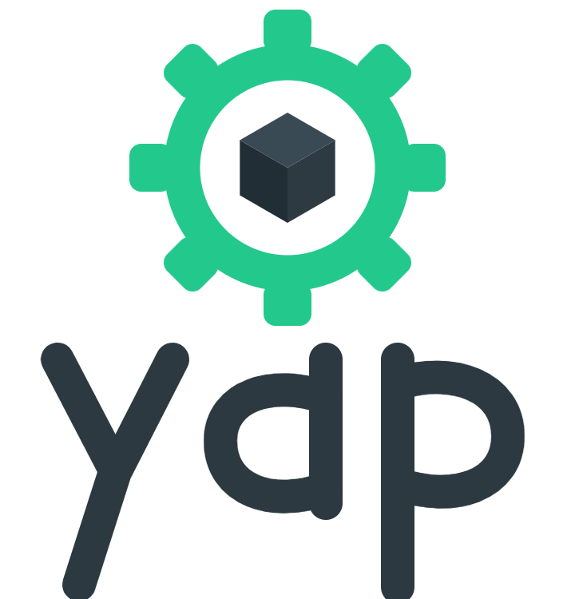

# YAP — Yet Another Packager



[](http://goreportcard.com/report/M0Rf30/yap)
[](examples)
[](https://www.gnu.org/licenses/gpl-3.0)
[](https://goreportcard.com/report/github.com/M0Rf30/yap)
[](https://github.com/M0Rf30/yap/releases/latest)

YAP builds native packages for multiple GNU/Linux distributions from a single PKGBUILD specification. Write your package once; get `.deb`, `.rpm`, `.apk`, and `.pkg.tar.zst` out. All builds run in isolated OCI containers (Docker or Podman).

## Features

- **Multi-format output**: DEB (Debian/Ubuntu), RPM (Fedora/RHEL/Rocky/openSUSE), APK (Alpine), TAR.ZST (Arch)
- **Container isolation**: reproducible builds, no host contamination, Docker and Podman supported
- **PKGBUILD-based**: familiar Arch Linux syntax extended with distribution and architecture overrides
- **Cross-compilation**: build for a different architecture than your host
- **Dependency-aware builds**: sequential by default; opt-in parallel topo-sort via `--parallel`
- **Package signing**: APK RSA + DEB/RPM/Pacman GPG (no `gpg` binary required)
- **SBOM generation**: CycloneDX 1.5 and SPDX 2.3 sidecars
- **Per-format compression**: `zstd`/`gzip`/`xz` for DEB and RPM
- **Changelog support**: `changelog` PKGBUILD field renders to native format per distro
- **Pacman scriptlets**: full 6-hook lifecycle (pre/post install/upgrade/remove)
- **Structured logging**: slog-based, tree rendering for long lines, zero external UI deps

## Installation

One-liner (Linux/macOS, amd64/arm64):

```bash
curl -fsSL https://raw.githubusercontent.com/M0Rf30/yap/main/scripts/install.sh | sh
```

Pin a version or install only one tool:

```bash
curl -fsSL https://raw.githubusercontent.com/M0Rf30/yap/main/scripts/install.sh \
  | sh -s -- --version v2.1.3 --tool yap
```

Manual download:

```bash
wget https://github.com/M0Rf30/yap/releases/latest/download/yap_Linux_x86_64.tar.gz
tar -xzf yap_Linux_x86_64.tar.gz
sudo mv yap /usr/local/bin/
yap version
```

### Build from source

```bash
git clone https://github.com/M0Rf30/yap.git
cd yap
make build
sudo mv yap /usr/local/bin/
```

Requires Docker or Podman:

```bash
# Docker
sudo systemctl enable --now docker && sudo usermod -aG docker $USER

# Podman
sudo systemctl enable --now podman
```

## Quick start

### 1. Project structure

Create `yap.json`:

```json
{
  "name": "My Package",
  "description": "A sample package built with YAP",
  "buildDir": "/tmp/yap-build",
  "output": "artifacts",
  "projects": [
    { "name": "my-package" }
  ]
}
```

### 2. PKGBUILD

Create `my-package/PKGBUILD`:

```bash
pkgname=my-package
pkgver=1.0.0
pkgrel=1
pkgdesc="My awesome application"
arch=('x86_64')
license=('GPL-3.0')
url="https://github.com/user/my-package"
makedepends=('gcc' 'make')
source=("https://github.com/user/my-package/archive/v${pkgver}.tar.gz")
sha256sums=('SKIP')

build() {
    cd "${srcdir}/${pkgname}-${pkgver}"
    make
}

package() {
    cd "${srcdir}/${pkgname}-${pkgver}"
    install -Dm755 my-package "${pkgdir}/usr/bin/my-package"
    install -Dm644 README.md "${pkgdir}/usr/share/doc/${pkgname}/README.md"
}
```

### 3. Build

```bash
# Auto-detect host distro from /etc/os-release
yap build .

# Specific distribution
yap build ubuntu-jammy .
yap build fedora-38 /path/to/project
yap build --cleanbuild --nomakedeps ubuntu-jammy .
```

### 4. Output

```
artifacts/
├── my-package_1.0.0-1_amd64.deb
├── my-package-1.0.0-1.x86_64.rpm
├── my-package-1.0.0-r1.apk
└── my-package-1.0.0-1-x86_64.pkg.tar.zst
```

## Project configuration (`yap.json`)

```json
{
  "name": "My Multi-Package Project",
  "description": "Project description",
  "buildDir": "/tmp/yap-builds",
  "output": "dist",
  "cleanPrevious": true,
  "projects": [
    { "name": "package-one", "depends": [] },
    { "name": "package-two", "depends": ["package-one"] }
  ]
}
```

| Field | Default | Description |
|-------|---------|-------------|
| `name` | — | Project display name |
| `description` | — | Project description |
| `buildDir` | `/tmp` | Temporary build directory |
| `output` | `artifacts` | Output directory for built packages |
| `cleanPrevious` | `false` | Clean previous builds before starting |
| `projects` | — | Array of packages to build |
| `depends` | — | Build-time ordering dependencies |

### Editor validation (JSON Schema)

A JSON Schema for `yap.json` ships at the repo root: [`yap.schema.json`](./yap.schema.json).
It documents every supported field (compression, signing, repos, SBOM,
cross-compilation, etc.). Reference it from your `yap.json` for autocomplete and
inline validation in editors that support JSON Schema:

```json
{
  "$schema": "https://raw.githubusercontent.com/M0Rf30/yap/main/yap.schema.json",
  "name": "My Multi-Package Project",
  "...": "..."
}
```

The schema is also being submitted to [SchemaStore](https://www.schemastore.org)
so editors validate any `yap.json` by filename automatically — no `$schema`
line required.

## PKGBUILD extensions

### Distribution-specific variables

Use `__` (double underscore) to override any variable per distribution. Priority (highest wins):

| Priority | Syntax | Example |
|----------|--------|---------|
| 4+ | arch + distro | `depends_x86_64__ubuntu_noble` |
| 4 | arch only | `depends_x86_64` |
| 3 | distro + codename | `depends__ubuntu_noble` |
| 2 | distro | `depends__ubuntu` |
| 1 | package manager | `depends__apt` |
| 0 | base (fallback) | `depends` |

```bash
pkgdesc="My application"
pkgdesc__debian="My application for Debian/Ubuntu"
pkgdesc__ubuntu_noble="My application optimized for Ubuntu 24.04"

makedepends=('gcc' 'make')
makedepends__apt=('build-essential' 'cmake')
makedepends__yum=('gcc-c++' 'cmake3')
makedepends__ubuntu_noble=('build-essential' 'cmake' 'pkg-config' 'libtool')
```

### Architecture-specific variables

```bash
depends=('glibc' 'gcc')
depends_x86_64=('glibc' 'gcc' 'lib32-glibc')
depends_aarch64=('glibc' 'gcc' 'aarch64-linux-gnu-gcc')

source=('https://example.com/generic-source.tar.gz')
source_x86_64=('https://example.com/x86_64-optimized.tar.gz')
source_aarch64=('https://example.com/aarch64-source.tar.gz')

sha256sums=('generic_hash')
sha256sums_x86_64=('x86_64_specific_hash')
sha256sums_aarch64=('aarch64_specific_hash')
```

Supported architectures: `x86_64`, `i686`, `aarch64`, `armv7h`, `armv6h`, `armv5`, `ppc64`, `ppc64le`, `s390x`, `mips`, `mipsle`, `riscv64`, `pentium4`, `any`.

### Checksum types

Supported (strongest to fastest): `b2sums`, `sha512sums`, `sha384sums`, `sha256sums`, `sha224sums`, `cksums`.

```bash
# BLAKE2b (recommended)
b2sums=('2f240f2a3d2f8d8f...')

# CRC32 (format: checksum filesize)
cksums=('1234567890 2048576')
```

### Changelog

```bash
changelog=CHANGELOG.md
```

- **DEB**: `usr/share/doc/<pkgname>/changelog.Debian.gz` (Lintian-compliant)
- **Pacman**: `.CHANGELOG` in the archive
- **APK**: ignored (no Alpine convention)
- **RPM**: deferred (rpmpack API gap)

### Pacman scriptlets

```bash
pre_install()  { echo "Before install"; }
post_install() { systemctl daemon-reload; }
pre_upgrade()  { systemctl stop myservice; }
post_upgrade() { systemctl start myservice; }
pre_remove()   { systemctl disable myservice; }
post_remove()  { systemctl daemon-reload; }
```

Emitted to `<pkgname>.install` only when at least one hook is defined. `pre/post_upgrade` fall back to `pre/post_install` when absent.

### Package manager-specific fields

```bash
# DEB
section=utils
priority=optional

# RPM
group="Applications/System"
requires_pre=('shadow-utils')

# APK
maintainer="John Doe <john@example.com>"
```

## Supported distributions

| Distribution ID | Format | Package Manager |
|-----------------|--------|-----------------|
| `almalinux` | `.rpm` | yum |
| `alpine` | `.apk` | apk |
| `amzn` | `.rpm` | yum |
| `arch` | `.pkg.tar.zst` | pacman |
| `centos` | `.rpm` | yum |
| `debian` | `.deb` | apt |
| `fedora` | `.rpm` | dnf |
| `linuxmint` | `.deb` | apt |
| `opensuse-leap` | `.rpm` | zypper |
| `opensuse-tumbleweed` | `.rpm` | zypper |
| `ol` | `.rpm` | yum |
| `pop` | `.deb` | apt |
| `rhel` | `.rpm` | yum |
| `rocky` | `.rpm` | yum |
| `ubuntu` | `.deb` | apt |

## Model Context Protocol (MCP)

YAP ships a companion `yap-mcp` binary that exposes the same build pipeline
over the [Model Context Protocol](https://modelcontextprotocol.io), so any
MCP-compatible LLM client (Claude Desktop, opencode, Cursor, Zed, Continue,
Goose, …) can drive yap directly.

Quickstart (release binary):

```sh
curl -fsSL https://raw.githubusercontent.com/M0Rf30/yap/main/scripts/install.sh | sh
# then add { "mcpServers": { "yap": { "command": "yap-mcp" } } } to your client config
```

Or pull the standalone OCI image (also listed on the
[MCP registry](https://registry.modelcontextprotocol.io) as `io.github.M0Rf30/yap`):

```sh
docker pull ghcr.io/m0rf30/yap-mcp:latest
# client config:
# { "mcpServers": { "yap": { "command": "docker",
#   "args": ["run","-i","--rm","ghcr.io/m0rf30/yap-mcp:latest"] } } }
```

### Claude Code plugin (server + skill in one)

```text
/plugin marketplace add M0Rf30/claude-plugins
/plugin install yap@M0Rf30
```

### Smithery

```sh
npx @smithery/cli install io.github.M0Rf30/yap --client claude
```

The full tool surface, per-client config snippets, security model, and
troubleshooting are in **[`MCP.md`](MCP.md)**. The shipped skill card at
[`skills/yap/SKILL.md`](skills/yap/SKILL.md) follows the Anthropic Agent
Skills layout and gives agents a workflow cheatsheet for free. Distribution
channels and release steps are documented in **[`PUBLISHING.md`](PUBLISHING.md)**.

## CLI reference

### Commands

```bash
yap build [distro[-release]] <path>   # Build packages (distro auto-detected if omitted)
yap zap [distro] <path>               # Clean build environment
yap prepare [distro[-release]]        # Prepare host build environment
yap pull <distro>                     # Pull pre-built container images
yap install <artifact-file>           # Install a built artifact
yap graph [path]                      # Show dependency graph
yap list-distros                      # List supported distributions
yap status                            # Show host status and runtime detection
yap version                           # Show version information
yap completion <shell>                # Generate shell completion (bash/zsh/fish/powershell)
```

### Build flags

```bash
# Build behavior
--cleanbuild              # Clean srcdir before build
--nobuild                 # Download sources only
--zap                     # Deep clean staging directory

# Dependencies
--nomakedeps              # Skip makedeps installation
--skip-sync               # Skip package manager sync
--parallel                # Enable parallel topo-sort (opt-in)

# Version
--pkgver 1.2.3            # Override package version
--pkgrel 2                # Override release number

# Range
--from package1           # Start from specific package
--to package5             # Stop at specific package
--only pkg1,pkg2          # Build only listed packages

# Cross-compilation
--target-arch arm64       # Cross-compile for target architecture
--skip-toolchain-validation

# Signing
--sign                    # Enable artifact signing
--sign-key /path/to/key   # Private key path
--sign-passphrase pass    # Passphrase (prefer env: YAP_SIGN_PASSPHRASE)
--sign-key-name mykey     # APK key name

# SBOM
--sbom                    # Generate SBOM sidecars
--sbom-format cyclonedx   # CycloneDX 1.5 only
--sbom-format spdx        # SPDX 2.3 only
--sbom-format both        # Both (default)

# Compression
--compression-deb gzip    # DEB: zstd|gzip|xz (default: zstd)
--compression-rpm xz      # RPM: zstd|gzip|xz (default: zstd)

# Debug
--debug-dir /path         # Emit split debug info
--verbose                 # Verbose logging
--no-color                # Disable colored output
```

### Shell completion

```bash
yap completion bash > /etc/bash_completion.d/yap
yap completion zsh > /usr/share/zsh/site-functions/_yap
yap completion fish > ~/.config/fish/completions/yap.fish
yap completion powershell > yap.ps1
```

## Package signing

| Format | Algorithm | Output |
|--------|-----------|--------|
| APK | RSA PKCS#1 v1.5 SHA1 | `.SIGN.RSA.<keyname>.rsa.pub` embedded stream |
| DEB | OpenPGP | `<package>.deb.asc` (ASCII-armored detached) |
| RPM | OpenPGP | `<package>.rpm.asc` + optional in-RPM via rpmpack |
| Pacman | OpenPGP | `<package>.pkg.tar.zst.sig` (binary detached) |

Signing uses `github.com/ProtonMail/go-crypto/openpgp` — no `gpg` binary required.

### Key resolution (highest to lowest)

1. `--sign-key <path>` CLI flag
2. Format env: `YAP_APK_KEY`, `YAP_DEB_KEY`, `YAP_RPM_KEY`, `YAP_PACMAN_KEY`
3. Global env: `YAP_SIGN_KEY`
4. `yap.json` field `signing.keyPath`
5. `~/.config/yap/keys/<format>.{rsa,gpg}` then `~/.config/yap/keys/default.{rsa,gpg}`

Passphrase resolution mirrors key resolution with `_PASSPHRASE` suffix.

### yap.json signing config

```json
{
  "signing": {
    "enabled": true,
    "keyPath": "~/.config/yap/keys/release.gpg",
    "keyName": "release"
  }
}
```

### Verifying signed packages

```bash
# APK (after distributing the public key to /etc/apk/keys/)
apk add my-package.apk

# DEB
gpg --verify my-package_1.0.0_amd64.deb.asc my-package_1.0.0_amd64.deb

# RPM
rpm -K my-package-1.0.0-1.x86_64.rpm

# Pacman
pacman-key --verify my-package-1.0.0-1-x86_64.pkg.tar.zst.sig
```

## SBOM generation

```bash
yap build --sbom .                        # Both formats (default)
yap build --sbom --sbom-format cyclonedx .
yap build --sbom --sbom-format spdx .
```

Output alongside each artifact:

```
artifacts/
└── my-package_1.0.0-1_amd64.deb
    my-package_1.0.0-1_amd64.deb.cdx.json   ← CycloneDX 1.5
    my-package_1.0.0-1_amd64.deb.spdx.json  ← SPDX 2.3
```

Captured: name, version, license, runtime/build deps, source URLs and checksums, file hashes, DESCRIBES/DEPENDS_ON relationships.

## Advanced usage

### Cross-compilation

```bash
yap build --target-arch=aarch64 ubuntu-jammy .
yap build --target-arch=armv7 fedora-38 .
yap build --target-arch=i686 alpine .
yap build --target-arch=ppc64le arch .
```

YAP installs the required cross-compilation toolchains and configures the build environment automatically.

### Multi-package projects

```json
{
  "name": "My Suite",
  "projects": [
    { "name": "core-library", "install": true },
    { "name": "main-application", "install": true },
    { "name": "plugins", "install": false }
  ]
}
```

Packages with `"install": true` are installed immediately after building so subsequent packages can use them as build-time dependencies.

```bash
# Sequential (default) — explicit ordering via "install" field
yap build .

# Parallel — topo-sort + worker pool
yap build --parallel .
```

### Build environment preparation

```bash
yap prepare                    # Auto-detect host distro
yap prepare ubuntu-jammy
yap prepare fedora-38
yap prepare --golang arch
yap prepare --skip-sync rocky-9
```

### CI/CD integration

#### GitHub Actions

```yaml
name: Build Packages
on: [push, pull_request]

jobs:
  build:
    runs-on: ubuntu-latest
    steps:
      - uses: actions/checkout@v4

      - name: Install YAP
        run: |
          wget https://github.com/M0Rf30/yap/releases/latest/download/yap_Linux_x86_64.tar.gz
          tar -xzf yap_Linux_x86_64.tar.gz
          sudo mv yap /usr/local/bin/

      - name: Build Packages
        run: yap build

      - name: Upload Artifacts
        uses: actions/upload-artifact@v4
        with:
          name: packages
          path: artifacts/
```

#### GitLab CI

```yaml
build-packages:
  stage: build
  image: ubuntu:22.04
  before_script:
    - apt-get update && apt-get install -y wget docker.io
    - wget https://github.com/M0Rf30/yap/releases/latest/download/yap_Linux_x86_64.tar.gz
    - tar -xzf yap_Linux_x86_64.tar.gz && mv yap /usr/local/bin/
  script:
    - yap build
  artifacts:
    paths:
      - artifacts/
    expire_in: 1 week
```

## Examples

The [examples](examples) directory contains complete, ready-to-build projects:

| Example | Description |
|---------|-------------|
| [circular-deps](examples/circular-deps) | Circular dependency detection — YAP fails with a clear error |
| [dependency-orchestration](examples/dependency-orchestration) | 5-package project with automatic dep resolution and build ordering |
| [yap](examples/yap) | YAP packaging itself — Go application with install scripts |
| [split-package](examples/split-package) | One build producing multiple installable packages with distro overrides |
| [multi-architecture](examples/multi-architecture) | Architecture-specific sources, deps, and checksums |

## PKGBUILD examples

### Simple C application

```bash
pkgname=hello-world
pkgver=1.0.0
pkgrel=1
pkgdesc="A simple Hello World program"
arch=('x86_64')
license=('MIT')
makedepends=('gcc')
source=("hello.c")
sha256sums=('SKIP')

build() { gcc -o hello hello.c; }

package() { install -Dm755 hello "${pkgdir}/usr/bin/hello"; }
```

### Python application

```bash
pkgname=python-myapp
pkgver=2.1.0
pkgrel=1
pkgdesc="My Python application"
arch=('any')
license=('Apache-2.0')
depends=('python3')
makedepends__apt=('python3-dev' 'python3-setuptools')
makedepends__yum=('python3-devel' 'python3-setuptools')
source=("https://pypi.io/packages/source/m/myapp/myapp-${pkgver}.tar.gz")
sha256sums=('...')

build() {
    cd "${srcdir}/myapp-${pkgver}"
    python3 setup.py build
}

package() {
    cd "${srcdir}/myapp-${pkgver}"
    python3 setup.py install --root="${pkgdir}" --optimize=1
}
```

### Web service with systemd

```bash
pkgname=web-service
pkgver=1.5.0
pkgrel=1
pkgdesc="My web service"
arch=('x86_64')
license=('GPL-3.0')
depends=('systemd')
backup=('etc/web-service/config.yml')
source=("web-service-${pkgver}.tar.gz" "web-service.service")
sha256sums=('...' 'SKIP')

build() {
    cd "${srcdir}/web-service-${pkgver}"
    make build
}

package() {
    cd "${srcdir}/web-service-${pkgver}"
    install -Dm755 web-service "${pkgdir}/usr/bin/web-service"
    install -Dm644 ../web-service.service \
        "${pkgdir}/usr/lib/systemd/system/web-service.service"
    install -Dm644 config.yml "${pkgdir}/etc/web-service/config.yml"
    install -dm755 "${pkgdir}/var/lib/web-service"
    install -dm755 "${pkgdir}/var/log/web-service"
}
```

## Development

### Make targets

```bash
make all              # clean, deps, fmt, lint, test, doc, build
make build            # build the yap binary
make build-all        # build for linux/darwin/windows, amd64/arm64
make clean            # clean build artifacts
make deps             # download and tidy Go modules
make fmt              # gofmt
make lint             # golangci-lint
make lint-md          # markdownlint
make test             # run all tests (-p 1 -v, sequential required)
make test-coverage    # tests with coverage report (coverage.html)
make release          # create release packages

make doc              # view all package documentation
make doc-serve        # start pkgsite on localhost:8080
make doc-generate     # generate static docs in docs/api/
make doc-package PKG=./pkg/builders/apk

make docker-build DISTRO=ubuntu
make docker-build-all
make docker-list-distros

make i18n-check       # verify localization file integrity
make i18n-stats       # localization statistics
```

### Testing

Tests must run sequentially (`-p 1`):

```bash
make test
go test ./pkg/source -v
go test ./pkg/builders/deb -v
go test ./pkg/graph -v
go test -race ./pkg/builders/...
go test -timeout 30s ./pkg/download/...
```

### Internationalization

Supported languages: English (`en`), Italian (`it`).

Language is auto-detected from `LANG`/`LC_ALL`/`LC_MESSAGES`/`LANGUAGE`. Override with `--language` / `-l`:

```bash
yap --language=it build .
```

To add a language: copy `pkg/i18n/locales/en.yaml` to `pkg/i18n/locales/{code}.yaml`, translate, add the code to `SupportedLanguages` in `pkg/i18n/i18n.go`, submit a PR.

## Troubleshooting

### Container runtime

```bash
systemctl status docker       # or podman
docker run --rm hello-world   # test access
sudo usermod -aG docker $USER # fix permissions (re-login required)
```

### Build failures

```bash
yap build --verbose
yap zap ubuntu-jammy /path/to/project
yap status
```

### Permission issues

```bash
sudo chown -R $USER:$USER artifacts/
setsebool -P container_manage_cgroup true   # SELinux (Red Hat family)
```

### Performance

```bash
yap build --skip-sync     # skip package manager sync
yap build --cleanbuild    # clean source before build
```

## Contributing

1. Fork the repository
2. Create a feature branch: `git checkout -b feature/my-feature`
3. Make changes and add tests
4. Run `make fmt lint test`
5. Commit and open a pull request

See [CODE_OF_CONDUCT.md](CODE_OF_CONDUCT.md) for community guidelines.

## License

GNU General Public License v3.0. See [LICENSE.md](LICENSE.md).

## Credits

- [Zachary Huff](https://github.com/zachhuff386) for contributions to Pacur, the project that inspired YAP
- The Arch Linux community for the PKGBUILD format
- All contributors

Built with [Go](https://golang.org/), [Cobra](https://github.com/spf13/cobra), [Docker](https://www.docker.com/) / [Podman](https://podman.io/).

---

[Report issues](https://github.com/M0Rf30/yap/issues) · [Discussions](https://github.com/M0Rf30/yap/discussions) · [Wiki](https://github.com/M0Rf30/yap/wiki)
