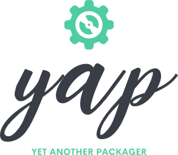

# YAP - Yet Another Packager



[](http://goreportcard.com/report/M0Rf30/yap)
[](examples)
[](https://www.gnu.org/licenses/gpl-3.0)
[](https://goreportcard.com/report/github.com/M0Rf30/yap)
[](https://github.com/M0Rf30/yap/releases/latest)

## 🚀 Introduction

**YAP (Yet Another Packager)** is a modern, cross-distribution package building tool designed to simplify the complex process of creating packages for multiple GNU/Linux distributions. With YAP, you can maintain a single package specification and build native packages for various distributions including **Debian**, **Ubuntu**, **Fedora**, **CentOS**, **Rocky Linux**, **Alpine**, **Arch Linux**, and more.

YAP eliminates the need to learn multiple packaging formats and build systems by providing a unified interface based on the familiar **PKGBUILD** format from Arch Linux, extended with multi-distribution support and modern container-based builds.

## ✨ Key Features

### 🐳 **Container-Based Isolation**
- **OCI Container Builds**: All builds run in isolated OCI containers (Docker/Podman)
- **No Host Contamination**: Clean build environments without affecting your system
- **Reproducible Builds**: Consistent results across different environments
- **Multi-Architecture Support**: Build for different CPU architectures

### 📦 **Multi-Format Package Support**
- **RPM Packages**: For Red Hat, CentOS, Rocky Linux, Fedora, OpenSUSE
- **DEB Packages**: For Debian, Ubuntu, Linux Mint, Pop!_OS
- **APK Packages**: For Alpine Linux
- **TAR.ZST Archives**: For Arch Linux and generic distributions
- **Future-Ready**: Extensible architecture for additional formats

### 🔧 **Advanced Build Features**
- **Dependency-Aware Building**: Intelligent build ordering based on dependencies
- **Parallel Builds**: Multi-package builds with optimal parallelization
- **Component Logging**: Clear, tagged logging for complex build processes
- **Enhanced PKGBUILD Support**: Extended syntax with custom variables and arrays
- **Cross-Distribution Variables**: Distribution-specific configurations in single file

### 🎯 **Developer Experience**
- **Simple Configuration**: JSON project files with minimal setup
- **Familiar Syntax**: PKGBUILD-based with intuitive extensions
- **Rich CLI**: Comprehensive command-line interface with auto-completion
- **Detailed Logging**: Component-aware logging with build progress tracking
- **Error Handling**: Clear error messages and debugging information

## 📥 Installation

### Quick Install (Recommended)

```bash
# Download and install the latest release
curl -fsSL https://raw.githubusercontent.com/M0Rf30/yap/main/install.sh | sh
```

### Manual Installation

```bash
# Download the latest release
wget https://github.com/M0Rf30/yap/releases/latest/download/yap_Linux_x86_64.tar.gz

# Extract the archive
tar -xzf yap_Linux_x86_64.tar.gz

# Install to system path
sudo mv yap /usr/local/bin/

# Verify installation
yap version
```

### Build from Source

```bash
# Clone the repository
git clone https://github.com/M0Rf30/yap.git
cd yap

# Build YAP
go build -o yap cmd/yap/yap.go

# Install
sudo mv yap /usr/local/bin/
```

### Container Support

Ensure you have either **Docker** or **Podman** installed:

```bash
# For Docker
sudo systemctl enable --now docker
sudo usermod -aG docker $USER

# For Podman
sudo systemctl enable --now podman
```

## 🚀 Quick Start

### 1. Create a Project Structure

```bash
mkdir my-package && cd my-package
```

Create a project configuration file `yap.json`:

```json
{
  "name": "My Package",
  "description": "A sample package built with YAP",
  "buildDir": "/tmp/yap-build",
  "output": "artifacts",
  "projects": [
    {
      "name": "my-package"
    }
  ]
}
```

### 2. Create a PKGBUILD

Create directory `my-package/` and add a `PKGBUILD` file:

```bash
mkdir my-package
```

Create `my-package/PKGBUILD`:

```bash
pkgname=my-package
pkgver=1.0.0
pkgrel=1
pkgdesc="My awesome application"
pkgdesc__debian="My awesome application for Debian"
pkgdesc__alpine="My awesome application for Alpine"
arch=('x86_64')
license=('GPL-3.0')
url="https://github.com/user/my-package"
makedepends=('gcc' 'make')
source=("https://github.com/user/my-package/archive/v${pkgver}.tar.gz")
sha256sums=('SKIP')

build() {
    cd "${srcdir}/${pkgname}-${pkgver}"
    make
}

package() {
    cd "${srcdir}/${pkgname}-${pkgver}"
    install -Dm755 my-package "${pkgdir}/usr/bin/my-package"
    install -Dm644 README.md "${pkgdir}/usr/share/doc/${pkgname}/README.md"
}
```

### 3. Build Your Package

```bash
# Build for current system distribution
yap build .

# Build for specific distribution  
yap build ubuntu-jammy .
yap build fedora-38 /path/to/project

# Build with specific options
yap build --cleanbuild --nomakedeps ubuntu-jammy .
```

### 4. Find Your Packages

Built packages will be available in the `artifacts/` directory (or your specified output directory):

```
artifacts/
├── debian/
│   └── my-package_1.0.0-1_amd64.deb
├── ubuntu/
│   └── my-package_1.0.0-1_amd64.deb
├── fedora/
│   └── my-package-1.0.0-1.x86_64.rpm
├── alpine/
│   └── my-package-1.0.0-r1.apk
└── arch/
    └── my-package-1.0.0-1-x86_64.pkg.tar.zst
```

## 📖 Documentation

### Project Configuration (`yap.json`)

The project configuration file defines build settings and project structure:

```json
{
  "name": "My Multi-Package Project",
  "description": "Project description",
  "buildDir": "/tmp/yap-builds",
  "output": "dist",
  "cleanPrevious": true,
  "projects": [
    {
      "name": "package-one",
      "depends": []
    },
    {
      "name": "package-two", 
      "depends": ["package-one"]
    }
  ]
}
```

**Configuration Options:**
- `name`: Project display name
- `description`: Project description
- `buildDir`: Temporary build directory (default: `/tmp`)
- `output`: Output directory for built packages (default: `artifacts`)
- `cleanPrevious`: Clean previous builds (default: `false`)
- `projects`: Array of packages to build
- `depends`: Package build dependencies (for build ordering)

### PKGBUILD Extensions

YAP extends the standard PKGBUILD format with multi-distribution support:

#### Distribution-Specific Variables

```bash
# Base description
pkgdesc="My application"

# Distribution-specific descriptions
pkgdesc__debian="My application for Debian/Ubuntu"
pkgdesc__fedora="My application for Fedora/CentOS"
pkgdesc__alpine="My application for Alpine Linux"
pkgdesc__arch="My application for Arch Linux"

# Distribution-specific dependencies
makedepends=('gcc' 'make')
makedepends__apt=('build-essential' 'cmake')
makedepends__yum=('gcc-c++' 'cmake3')
makedepends__apk=('build-base' 'cmake')
```

#### Enhanced Array Support

```bash
# Arrays with custom variables
config_files=('/etc/myapp/config.yml' '/etc/myapp/logging.yml')
service_files=('myapp.service' 'myapp-worker.service')

# Custom variables
custom_prefix="/opt/myapp"
custom_user="myapp"

package() {
    # Array expansion in loops
    for config in "${config_files[@]}"; do
        install -Dm644 "configs/$(basename $config)" "${pkgdir}${config}"
    done
    
    # Custom variable usage
    install -d "${pkgdir}${custom_prefix}"
    install -Dm644 myapp.conf "${pkgdir}/etc/myapp/"
}
```

#### Package Manager Specific Sections

```bash
# Debian/Ubuntu specific
section=utils
priority=optional

# RPM specific  
group="Applications/System"
requires_pre=('shadow-utils')

# Alpine specific
maintainer="John Doe <john@example.com>"
```

### Supported Distributions

YAP supports building packages for the following distributions:

| Distribution | Package Format | Container Base | Package Manager |
|-------------|----------------|----------------|-----------------|
| **Debian** | `.deb` | debian:stable | apt |
| **Ubuntu** | `.deb` | ubuntu:latest | apt |
| **Linux Mint** | `.deb` | linuxmint/mintbox | apt |
| **Pop!_OS** | `.deb` | pop-os/ubuntu | apt |
| **Fedora** | `.rpm` | fedora:latest | dnf |
| **CentOS** | `.rpm` | centos:latest | yum |
| **Rocky Linux** | `.rpm` | rockylinux:latest | dnf |
| **AlmaLinux** | `.rpm` | almalinux:latest | dnf |
| **Red Hat Enterprise Linux** | `.rpm` | redhat/ubi8 | yum |
| **openSUSE Leap** | `.rpm` | opensuse/leap | zypper |
| **Alpine Linux** | `.apk` | alpine:latest | apk |
| **Arch Linux** | `.pkg.tar.zst` | archlinux:latest | pacman |

### Command Line Interface

#### Available Commands

```bash
# Build Commands
yap build [distro] <path>        # Build packages from yap.json project
yap zap <distro> <path>          # Deeply clean build environment

# Environment Commands  
yap prepare <distro>             # Prepare build environment
yap pull <distro>                # Pull container images

# Utility Commands
yap graph [path]                 # Generate dependency graph visualization
yap completion <shell>           # Generate shell completion
yap list-distros                 # List supported distributions
yap status                       # Show system status
yap version                      # Show version information
```

#### Build Command Options

```bash
# Build behavior
yap build --cleanbuild           # Clean srcdir before build
yap build --nobuild              # Download sources only
yap build --zap                  # Deep clean staging directory

# Dependency management
yap build --nomakedeps           # Skip makedeps installation
yap build --skip-sync            # Skip package manager sync

# Version control
yap build --pkgver 1.2.3         # Override package version
yap build --pkgrel 2             # Override release number

# Build range
yap build --from package1        # Start from specific package
yap build --to package5          # Stop at specific package

# Source access
yap build --ssh-password pass    # SSH password for private repos

# Global options
yap build --verbose              # Enable verbose logging
yap build --no-color             # Disable colored output
```

#### Shell Completion

YAP provides auto-completion for popular shells:

```bash
# Bash
yap completion bash > /etc/bash_completion.d/yap

# Zsh  
yap completion zsh > /usr/share/zsh/site-functions/_yap

# Fish
yap completion fish > ~/.config/fish/completions/yap.fish

# PowerShell
yap completion powershell > yap.ps1
```

#### Dependency Graph Visualization

YAP can generate beautiful dependency graph visualizations to help understand project structure and build dependencies:

```bash
# Generate SVG graph for current project
yap graph .

# Generate graph with dark theme
yap graph --theme dark --output project-deps.svg .

# Generate PNG format (requires external conversion tools)
yap graph --format png --output docs/dependencies.png .

# Include external dependencies in visualization
yap graph --show-external --output complete-graph.svg .
```

**Graph Features:**
- **Interactive SVG**: Hover effects and tooltips with package information
- **Modern Themes**: Choose from modern, classic, or dark themes
- **Hierarchical Layout**: Packages arranged by dependency levels and build order
- **Color Coding**: Different colors for internal packages, external dependencies, and popular packages
- **Multiple Formats**: SVG (native) and PNG (via external conversion)
- **Documentation Ready**: High-quality output suitable for project documentation

**Graph Elements:**
- **Node Size**: Reflects dependency popularity (how many packages depend on it)
- **Node Colors**: Green for internal packages, orange for external, blue for popular packages
- **Arrows**: Show dependency direction (runtime vs make dependencies)
- **Levels**: Indicate build order and dependency hierarchy
- **Tooltips**: Display detailed package information on hover
```

## 🔧 Advanced Usage

### Multi-Package Projects

Build multiple related packages with dependency management:

```json
{
  "name": "My Suite",
  "projects": [
    {
      "name": "core-library",
      "depends": []
    },
    {
      "name": "main-application", 
      "depends": ["core-library"]
    },
    {
      "name": "plugins",
      "depends": ["main-application"]
    }
  ]
}
```

YAP will build packages in the correct order, installing dependencies as needed.

### Build Environment Preparation

```bash
# Prepare basic build environment
yap prepare ubuntu-jammy
yap prepare fedora-38

# Prepare with Go language support
yap prepare --golang arch

# Skip package manager sync (faster)
yap prepare --skip-sync rocky-9
```

### Integration with CI/CD

#### GitHub Actions

```yaml
name: Build Packages
on: [push, pull_request]

jobs:
  build:
    runs-on: ubuntu-latest
    steps:
      - uses: actions/checkout@v3
      
      - name: Install YAP
        run: |
          wget https://github.com/M0Rf30/yap/releases/latest/download/yap_Linux_x86_64.tar.gz
          tar -xzf yap_Linux_x86_64.tar.gz
          sudo mv yap /usr/local/bin/
          
      - name: Build Packages
        run: yap build
        
      - name: Upload Artifacts
        uses: actions/upload-artifact@v3
        with:
          name: packages
          path: artifacts/
```

#### GitLab CI

```yaml
stages:
  - build

build-packages:
  stage: build
  image: ubuntu:22.04
  before_script:
    - apt-get update && apt-get install -y wget docker.io
    - wget https://github.com/M0Rf30/yap/releases/latest/download/yap_Linux_x86_64.tar.gz
    - tar -xzf yap_Linux_x86_64.tar.gz && mv yap /usr/local/bin/
  script:
    - yap build
  artifacts:
    paths:
      - artifacts/
    expire_in: 1 week
```

### Performance Optimization

#### Build Options

```bash
# Clean builds for reproducibility
yap build --cleanbuild

# Skip unnecessary dependencies
yap build --nomakedeps

# Build specific package range
yap build --from package1 --to package5
```

## 🛠️ Development

### Building from Source

```bash
# Clone repository
git clone https://github.com/M0Rf30/yap.git
cd yap

# Install dependencies
make deps

# Build
make build

# Run tests
make test

# Install
make install
```

### Available Make Targets

YAP provides a comprehensive Makefile with various targets for development:

```bash
# Development targets
make build            # Build the application
make clean            # Clean build artifacts  
make test             # Run tests
make test-coverage    # Run tests with coverage report
make deps             # Download dependencies
make fmt              # Format code
make lint             # Lint code with golangci-lint
make lint-md          # Lint markdown files

# Documentation targets
make doc              # View all package documentation
make doc-serve        # Start documentation server on localhost:8080
make doc-package PKG=<path>  # View specific package docs
make doc-deps         # Install documentation tools
make doc-generate     # Generate static documentation files
make doc-serve-static # Serve static docs on localhost:8081

# Build targets
make run              # Build and run the application
make build-all        # Build for all architectures
make release          # Create release packages

# Docker targets
make docker-build DISTRO=<name>  # Build Docker image for distribution
make docker-build-all            # Build Docker images for all distributions
make docker-list-distros         # List available distributions

# Utility targets
make all              # Clean, deps, fmt, lint, test, doc, and build
make help             # Show available targets
```

### Examples

```bash
# Build YAP
make build

# Run tests with coverage
make test-coverage

# Format and lint code
make fmt lint

# Build Docker image for specific distribution
make docker-build DISTRO=ubuntu-noble

# Build all Docker images
make docker-build-all

# Start documentation server
make doc-serve

# Create release packages
make release
```

### Contributing

1. **Fork the repository**
2. **Create a feature branch**: `git checkout -b feature/amazing-feature`
3. **Make your changes** and add tests
4. **Run the test suite**: `make test`
5. **Commit your changes**: `git commit -m 'Add amazing feature'`
6. **Push to the branch**: `git push origin feature/amazing-feature`
7. **Open a Pull Request**

### Development Environment

```bash
# Set up development environment
make deps

# Format and lint code
make fmt lint

# Run tests
make test

# Build application
make build

# Generate documentation
make doc-generate

# Start documentation server
make doc-serve
```

## 📚 Examples

### Simple C Application

```bash
pkgname=hello-world
pkgver=1.0.0
pkgrel=1
pkgdesc="A simple Hello World program"
arch=('x86_64')
license=('MIT')
makedepends=('gcc')
source=("hello.c")
sha256sums=('SKIP')

build() {
    gcc -o hello hello.c
}

package() {
    install -Dm755 hello "${pkgdir}/usr/bin/hello"
}
```

### Python Application

```bash
pkgname=python-myapp
pkgver=2.1.0
pkgrel=1
pkgdesc="My Python application"
arch=('any')
license=('Apache-2.0')
depends=('python3')
makedepends=('python3-setuptools')
makedepends__apt=('python3-dev' 'python3-setuptools')
makedepends__yum=('python3-devel' 'python3-setuptools')
source=("https://pypi.io/packages/source/m/myapp/myapp-${pkgver}.tar.gz")
sha256sums=('...')

build() {
    cd "${srcdir}/myapp-${pkgver}"
    python3 setup.py build
}

package() {
    cd "${srcdir}/myapp-${pkgver}"  
    python3 setup.py install --root="${pkgdir}" --optimize=1
}
```

### Web Service with Systemd

```bash
pkgname=web-service
pkgver=1.5.0
pkgrel=1
pkgdesc="My web service"
arch=('x86_64')
license=('GPL-3.0')
depends=('systemd')
backup=('etc/web-service/config.yml')
source=("web-service-${pkgver}.tar.gz" "web-service.service")
sha256sums=('...' 'SKIP')

build() {
    cd "${srcdir}/web-service-${pkgver}"
    make build
}

package() {
    cd "${srcdir}/web-service-${pkgver}"
    
    # Install binary
    install -Dm755 web-service "${pkgdir}/usr/bin/web-service"
    
    # Install systemd service
    install -Dm644 ../web-service.service \
        "${pkgdir}/usr/lib/systemd/system/web-service.service"
    
    # Install configuration
    install -Dm644 config.yml \
        "${pkgdir}/etc/web-service/config.yml"
        
    # Create user and directories
    install -dm755 "${pkgdir}/var/lib/web-service"
    install -dm755 "${pkgdir}/var/log/web-service"
}
```

## 📁 Example Projects

The [examples](examples) directory contains complete, ready-to-build projects demonstrating YAP's capabilities:

### [Circular Dependency Detection](examples/circular-deps)
Demonstrates YAP's ability to detect and handle circular dependencies:
- **Purpose**: Tests circular dependency detection and error handling
- **Structure**: Two packages that depend on each other
- **Expected Outcome**: YAP detects the circular dependency and fails with a clear error message
- **Run**: `yap build examples/circular-deps`

### [Dependency Orchestration](examples/dependency-orchestration)
Complex multi-package project showcasing advanced dependency management:
- **Purpose**: Demonstrates automatic dependency resolution and build orchestration
- **Structure**: 5 interconnected packages with runtime dependencies
- **Features**: Automatic installation detection, topological build ordering, parallel builds
- **Run**: `yap build examples/dependency-orchestration`

### [YAP Self-Build](examples/yap)
Real-world example of packaging YAP itself:
- **Purpose**: Shows how to package a Go application with YAP
- **Structure**: Complete package definition for YAP with install scripts
- **Features**: Go module building, binary installation, systemd integration
- **Run**: `yap build examples/yap`

Each example includes detailed README files explaining the concepts, expected behavior, and learning objectives.

## 🐛 Troubleshooting

### Common Issues

#### Container Runtime Issues

```bash
# Check Docker/Podman status
systemctl status docker  # or podman

# Test container access
docker run --rm hello-world

# Check permissions
sudo usermod -aG docker $USER
# Log out and back in
```

#### Build Failures

```bash
# Enable verbose logging
yap build --verbose

# Clean build environment
yap zap ubuntu-jammy /path/to/project

# Check system status
yap status
```

#### Permission Issues

```bash
# Fix output directory permissions
sudo chown -R $USER:$USER artifacts/

# SELinux issues (Red Hat family)
setsebool -P container_manage_cgroup true
```

### Performance Issues

```bash
# Use clean builds
yap build --cleanbuild

# Skip sync for faster builds
yap build --skip-sync
```

### Getting Help

- **GitHub Issues**: [Report bugs and feature requests](https://github.com/M0Rf30/yap/issues)
- **Documentation**: [Wiki and guides](https://github.com/M0Rf30/yap/wiki)
- **Discussions**: [Community forum](https://github.com/M0Rf30/yap/discussions)

## 🤝 Community

### Contributing

We welcome contributions from the community! Whether it's:

- 🐛 **Bug reports** and feature requests
- 📝 **Documentation** improvements
- 🔧 **Code contributions** and bug fixes
- 🧪 **Testing** on different distributions
- 💡 **Ideas** for new features

See our [Contributing Guidelines](CONTRIBUTING.md) for details.

### Community Guidelines

- Be respectful and inclusive
- Follow our [Code of Conduct](CODE_OF_CONDUCT.md)
- Help others and share knowledge
- Contribute back to the project

## 📄 License

YAP is licensed under the **GNU General Public License v3.0**. See the [LICENSE](LICENSE.md) file for details.

## 🙏 Credits

### Acknowledgments

- **[Zachary Huff](https://github.com/zachhuff386)** for his significant contributions to **Pacur**, the project that inspired YAP
- **The Arch Linux Community** for the PKGBUILD format that serves as YAP's foundation
- **All Contributors** who have helped improve YAP

### Built With

- **[Go](https://golang.org/)** - Programming language
- **[Cobra](https://github.com/spf13/cobra)** - CLI framework
- **[Pterm](https://github.com/pterm/pterm)** - Terminal UI components
- **[Docker](https://www.docker.com/)** / **[Podman](https://podman.io/)** - Container runtime

---

<div align="center">

**Made with ❤️ by [M0Rf30](https://github.com/M0Rf30) and contributors**

[⭐ Star this project](https://github.com/M0Rf30/yap) • [🐛 Report Issues](https://github.com/M0Rf30/yap/issues) • [💡 Request Features](https://github.com/M0Rf30/yap/issues/new)

</div>